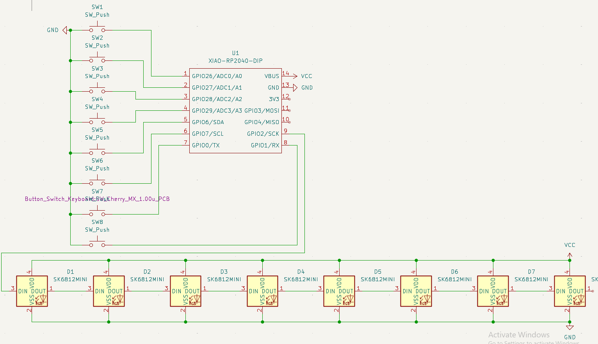
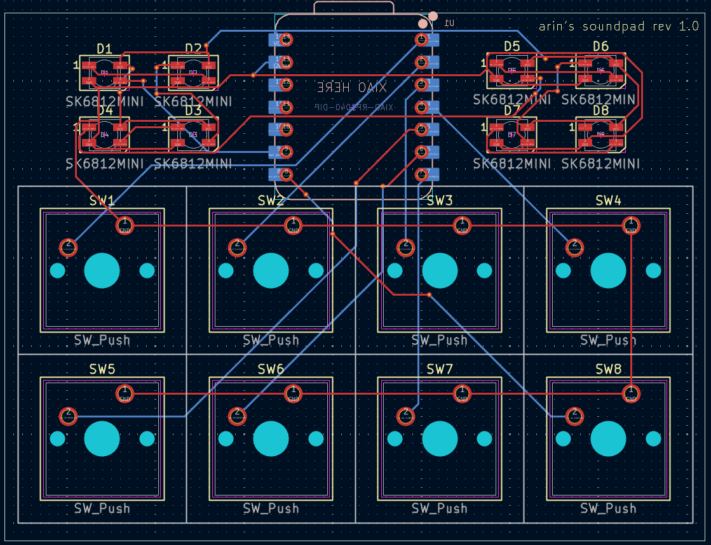

# arin's 8-key soundpad project

## Features:
- 8 keys configurable in my software
- 8 rgb leds

## Images
Schematic            |  PCB
:-------------------------:|:-------------------------:
  |  

CAD Model:

I made it in Shapr3D as it is easier for me than Fusion360.

## BOM
- 4x M3x16mm screws
- 4x M3x5mx4mm heatset inserts
- 8x SK6812 MINI-E LEDs
- 1x Seeed XIAO RP2040
- 8x MX-Style switches
- 8x Blank DSA keycaps
